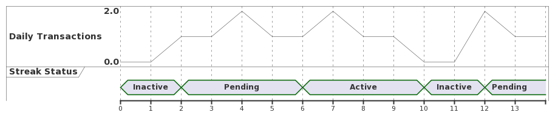

# LOKE Addon - Streaks

## Description

A LOKE addon to give regularly transacting customers the VIP treatment.

### What is a Streak?

There are a lot of different ways to consider streaks. So what is a streak in the context of this addon?

In a sentence the best way to describe it would be _"consistently transacting at a defined time interval"_.

In more detail - a streak is rewarded when you spend _at least once_ in sequential time windows, for example at least once per day, at least once per week, at least once per month.

## Why Reward Streaks?

Customers who already spend frequently are your most loyal customers. Apart from the business they bring in, they are the most likely to provide positive advocacy for your brand, and likely to be positively react to incentives like this.

A streak both gives a customer something to aim towards, and something to hold onto.

For example - if a customer needs to transact 4 weeks in a row to activate their streak, and they have currently done so for 2 weeks, then you set up a reward for them to actively ensure they spend at least once per week for the next 2.

In addition, once they have activated their streak by hitting the target they can keep their reward as long as they maintain their streak, so they now have an incentive to keep it up. A customer who may consider skipping eating/drinking at a store for one week might feel different knowing they'd lose their streak and go back to the starting point.

This is in essence similar to gaming streaks where you have to perform an action without being interrupted for a count of X. Once the streak is active it will typically remain active until the pattern is interrupted.

## What can I Reward Streaks With?

Anything you can use a LOKE segment for, such as discounts, redeemable promotions, exclusive content and information via info/web cards and broadcasts.

## Example Use-Cases

1) Customers who eat out at a restaurant every month for at least 3 months in a row get access to VIP rewards.
2) Customers of a coffee store who spend every week for at least 4 weeks running get onto a 10% discount list.
3) Customers who spend every hour in a bar for 3 hours straight get added to the daily VIP 10% discount list. They'll keep this discount for the rest of the night as long as they keep spending, discouraging them from bar hopping.

### Example with Diagram

The following diagram illustrates how a streak might work for a given organisation, where the units on the X-axis represent time interval units (days in this case). In this example the streak is activated once they hit 4 transacting days.

Once the customer transacts on day 2 their status is _pending_. They transact at least once daily for a while, and on day 6 they hit the 4-day threshold so their status is now active. They should now be offered the streak rewards, eg discounts or promotions. On day 10 they missed spending and their streak ended. They now lose their reward. On day 12 they transacted again, but have to work towards the 4 day threshold again.

## How it Works

For each organisation you configure:

1) A reward list for when a streak is activated
2) A pending list for when a customer starts spending, but have yet to activate their streak
3) The frequency interval unit the customer must transact at
4) The threshold/count of transaction-units required to activate the streak
5) The minimum $ spend required to count a customer spend
6) The timezone to use for frequency intervals (the system needs to have a single definition of midnight and hour-of-day for an organisation)

The system listens for payment events (customer spend) from LOKE for each configured organisation and discards any irrelevant ones - those that don't meet the minimum payment amount, or are a disallowed type (app purchases).

A streak is started when a customer spends and they currently do not have a running streak. The start time of the streak is the start time of the unit they are in.

> **NOTE: a time unit starts from the logical start of the block in the configured timezone, not from the the time of the first transaction. For example if a customer spends at 10:12AM on Tuesday the 3rd, then the hour unit starts 10:00AM on Tuesday the 3rd, day unit starts at 00:00AM on Tuesday 3rd, week unit starts 00:00AM Monday 2nd, month unit starts 00:00AM on Sunday 31st.**

A streak is maintained by a customer spending at least once per unit of time (minimum $ limits can be set, eg must be at least $10 to count).

A streak is lost when a customer does not transact within a unit of time.

A streak is activated when a customer maintains a streak for the required threshold of units.

An activated streak can be retained as long as the customer continues to spend each and every unit.

### Gotchas

1) Some time zones are 30 minutes offset from others. Using "hour" for unit will be hard to explain to users if an organization has venues in varying timezones like this and is best avoided.
2) Refunds are not supported, so if a customer purchases something that is then refunded they will still get the count towards their streak.

## Webview UI

There is a limited web UI that can be shown to customers, typically when they are in a "pending" streak state. This simple web UI shows them their current progress and when they need to next transact to maintain their streak. At present this is more for debugging, if valuable we may try and make it more suitable for real customers.

## Future Development Ideas

1. Staged streaks (eg bronze, silver, gold lists).
2. Queue transactions.
3. Webhook validation

## Contributing

### Local Configuration

Create a .env file in the root of the project.

Add all required configuration.

Run `npm start`

NOTE: you can run an in memory database by specifying `USE_MOCK_REPO=true`

### Database Migrations

Use knex, eg `npx knex migrate:make my_migration_name`
